# Obsidian용 MCP 서버

Local REST API 커뮤니티 플러그인을 통해 Obsidian과 상호작용하는 MCP 서버입니다.

<a href="https://glama.ai/mcp/servers/3wko1bhuek"></a>

## 구성 요소

### 도구

이 서버는 Obsidian과 상호작용하기 위한 여러 도구를 구현합니다:

- list_files_in_vault: Obsidian 볼트의 루트 디렉토리에 있는 모든 파일과 디렉토리 목록 조회
- list_files_in_dir: 특정 Obsidian 디렉토리의 모든 파일과 디렉토리 목록 조회
- get_file_contents: 볼트 내 특정 파일의 내용 조회
- search: 볼트 내 모든 파일에서 지정된 텍스트 쿼리와 일치하는 문서 검색
- patch_content: 제목, 블록 참조 또는 프론트매터 필드를 기준으로 기존 노트에 내용 삽입
- append_content: 새 파일 또는 기존 파일에 내용 추가

### 예시 프롬프트

먼저 Claude에게 Obsidian을 사용하도록 지시하는 것이 좋습니다. 그러면 항상 도구를 호출할 것입니다.

다음과 같은 프롬프트를 사용해보세요:

- 마지막 아키텍처 회의 노트의 내용을 가져와서 요약해줘
- Azure CosmosDb가 언급된 모든 파일을 검색하고 어떤 맥락에서 언급되었는지 간략하게 설명해줘
- 마지막 회의 노트를 요약하고 'summary meeting.md'라는 새 노트에 저장해줘. 이메일로 보낼 수 있도록 소개글도 추가해줘

## 코드베이스 구조

### 핵심 컴포넌트

#### 1. Obsidian 클래스 (`obsidian.py`)

Obsidian REST API와 직접 통신하는 클라이언트 구현체입니다:

- REST API 호출을 위한 기본 구성 요소 (URL, 헤더, 인증 등) 관리
- `_safe_call` 메서드를 통한 에러 처리 및 안전한 API 호출
- Obsidian API와 통신하는 다양한 메서드 제공:
  - `list_files_in_vault`, `list_files_in_dir`: 파일/디렉토리 목록 조회
  - `get_file_contents`, `get_batch_file_contents`: 파일 내용 조회
  - `search`, `search_json`: 텍스트 및 JsonLogic 기반 검색
  - `append_content`, `patch_content`: 파일 내용 수정/추가
  - `get_periodic_note`, `get_recent_periodic_notes`: 주기적 노트 관리
  - `get_recent_changes`: 최근 수정된 파일 조회

#### 2. ToolHandler 클래스들 (`tools.py`)

각 기능을 MCP 도구로 노출하는 클래스들:

- 추상 클래스 `ToolHandler`의 구현체들로 각 도구를 정의
- 각 도구는 두 가지 핵심 메서드 구현:
  - `get_tool_description()`: 도구의 메타데이터, 입력 스키마 등을 정의
  - `run_tool()`: 실제 도구의 실행 로직을 구현
- 주요 도구 핸들러:
  - 파일 관리: `ListFilesInVaultToolHandler`, `ListFilesInDirToolHandler`
  - 콘텐츠 조회: `GetFileContentsToolHandler`, `BatchGetFileContentsToolHandler`
  - 검색: `SearchToolHandler`, `ComplexSearchToolHandler`
  - 콘텐츠 수정: `AppendContentToolHandler`, `PatchContentToolHandler`
  - 주기적 노트: `PeriodicNotesToolHandler`, `RecentPeriodicNotesToolHandler`
  - 변경 추적: `RecentChangesToolHandler`

#### 3. MCP 서버 (`server.py`)

MCP 프로토콜 서버 구현:

- MCP 라이브러리의 `Server` 클래스 활용
- 환경 변수 로딩 및 API 키 검증
- 도구 핸들러 등록 및 관리 시스템
- MCP 요청 처리 함수:
  - `list_tools()`: 사용 가능한 도구 목록 제공
  - `call_tool()`: 지정된 도구 실행
- 서버 시작 및 이벤트 루프 관리

### 데이터 흐름

```mermaid
flowchart LR
    Claude[Claude] --> |도구 호출 요청\n도구 이름 + 인자| MCP[MCP 서버\nserver.py]
    MCP --> |요청 라우팅\n인자 유효성 검사| ToolHandler[도구 핸들러\ntools.py]
    ToolHandler --> |메서드 호출\n파라미터 변환| ObsidianClass[Obsidian 클래스\nobsidian.py]
    ObsidianClass --> |HTTP 요청| ObsidianAPI[Obsidian REST API\nLocal REST API 플러그인]
    ObsidianAPI --> |API 응답| ObsidianClass
    ObsidianClass --> |처리된 응답| ToolHandler
    ToolHandler --> |변환된 결과| MCP
    MCP --> |최종 응답| Claude

    classDef claudeClass fill:#f9d4d4,stroke:#333,stroke-width:2px
    classDef mcpClass fill:#d4f9d4,stroke:#333,stroke-width:2px
    classDef handlerClass fill:#d4d4f9,stroke:#333,stroke-width:2px
    classDef obsidianClass fill:#f9f9d4,stroke:#333,stroke-width:2px
    classDef apiClass fill:#f9d4f9,stroke:#333,stroke-width:2px

    class Claude claudeClass
    class MCP mcpClass
    class ToolHandler handlerClass
    class ObsidianClass obsidianClass
    class ObsidianAPI apiClass
```



## 프로젝트 확장 가이드

### 1. 새 도구 추가하기

새로운 Obsidian 기능을 위한 도구를 추가하려면:

1. `obsidian.py`에 필요한 API 호출 메서드 추가:

```python
def new_feature(self, param1, param2):
    url = f"{self.get_base_url()}/some-endpoint"

    def call_fn():
        response = requests.post(
            url,
            headers=self._get_headers(),
            json={"param1": param1, "param2": param2},
            verify=self.verify_ssl,
            timeout=self.timeout,
        )
        response.raise_for_status()
        return response.json()  # 또는 response.text

    return self._safe_call(call_fn)
```

2. `tools.py`에 새 도구 핸들러 클래스 구현:

```python
class NewFeatureToolHandler(ToolHandler):
    def __init__(self):
        super().__init__("obsidian_new_feature")

    def get_tool_description(self):
        return Tool(
            name=self.name,
            description="설명",
            inputSchema={
                "type": "object",
                "properties": {
                    "param1": {"type": "string", "description": "파라미터 설명"},
                    "param2": {"type": "integer", "description": "파라미터 설명"},
                },
                "required": ["param1", "param2"],
            },
        )

    def run_tool(self, args: dict) -> Sequence[TextContent | ImageContent | EmbeddedResource]:
        if "param1" not in args or "param2" not in args:
            raise RuntimeError("필수 파라미터가 누락되었습니다")

        api = obsidian.Obsidian(api_key=api_key)
        result = api.new_feature(args["param1"], args["param2"])

        return [TextContent(type="text", text=json.dumps(result, indent=2))]
```

3. `server.py`에 도구 핸들러 등록:

```python
add_tool_handler(tools.NewFeatureToolHandler())
```

### 2. 기존 도구 확장하기

기존 도구의 기능을 강화하려면:

1. `obsidian.py`의 메서드에 새 매개변수 추가
2. `tools.py`의 해당 도구 핸들러의 input 스키마와 실행 로직 업데이트
3. 필요 시 응답 처리 로직 수정

### 3. 에러 처리 향상

더 나은 에러 처리를 위해 특정 예외 클래스를 정의하고, `_safe_call` 메서드에서 이를 처리하도록 수정할 수 있습니다.

## 설정

### Obsidian REST API Key

Obsidian REST API 키로 환경을 설정하는 두 가지 방법이 있습니다.

1. 서버 구성에 추가 (권장)

```json
{
  "mcp-obsidian": {
    "command": "uvx",
    "args": ["mcp-obsidian"],
    "env": {
      "OBSIDIAN_API_KEY": "<API_키_입력>"
    }
  }
}
```

2. 작업 디렉토리에 다음과 같은 필수 변수가 포함된 `.env` 파일 생성:

```
OBSIDIAN_API_KEY=API_키_입력
```

참고: API 키는 Obsidian 플러그인 설정에서 확인할 수 있습니다.

## Quickstart

### Install

#### Obsidian REST API

Obsidian REST API 커뮤니티 플러그인이 필요합니다: https://github.com/coddingtonbear/obsidian-local-rest-api

설정에서 플러그인을 설치하고 활성화한 후 API 키를 복사하세요.

#### Claude Desktop

MacOS: `~/Library/Application\ Support/Claude/claude_desktop_config.json`

Windows: `%APPDATA%/Claude/claude_desktop_config.json`

<details>
  <summary>개발/미발행 서버 구성</summary>
  
```json
{
  "mcpServers": {
    "mcp-obsidian": {
      "command": "uv",
      "args": [
        "--directory",
        "<mcp-obsidian_경로>",
        "run",
        "mcp-obsidian"
      ]
    }
  }
}
```
</details>

<details>
  <summary>발행된 서버 구성</summary>
  
```json
{
  "mcpServers": {
    "mcp-obsidian": {
      "command": "uvx",
      "args": [
        "mcp-obsidian"
      ],
      "env": {
        "OBSIDIAN_API_KEY" : "<OBSIDIAN_API_키>"
      }
    }
  }
}
```
</details>

## Development

### Building

패키지 배포 준비를 위해:

1. 종속성 동기화 및 잠금 파일 업데이트:

```bash
uv sync
```

### Debugging

MCP 서버는 stdio를 통해 실행되므로 디버깅이 어려울 수 있습니다. 최상의 디버깅 경험을 위해 다음 도구 사용을 강력히 권장합니다.

- [MCP Inspector](https://github.com/modelcontextprotocol/inspector)

[`npm`](https://docs.npmjs.com/downloading-and-installing-node-js-and-npm)을 통해 MCP Inspector를 다음 명령으로 실행할 수 있습니다:

```bash
npx @modelcontextprotocol/inspector uv --directory /path/to/mcp-obsidian run mcp-obsidian
```

실행 시 Inspector는 브라우저에서 접근하여 디버깅을 시작할 수 있는 URL을 표시합니다.

다음 명령으로 서버 로그를 확인할 수도 있습니다:

```bash
tail -n 20 -f ~/Library/Logs/Claude/mcp-server-mcp-obsidian.log
```
